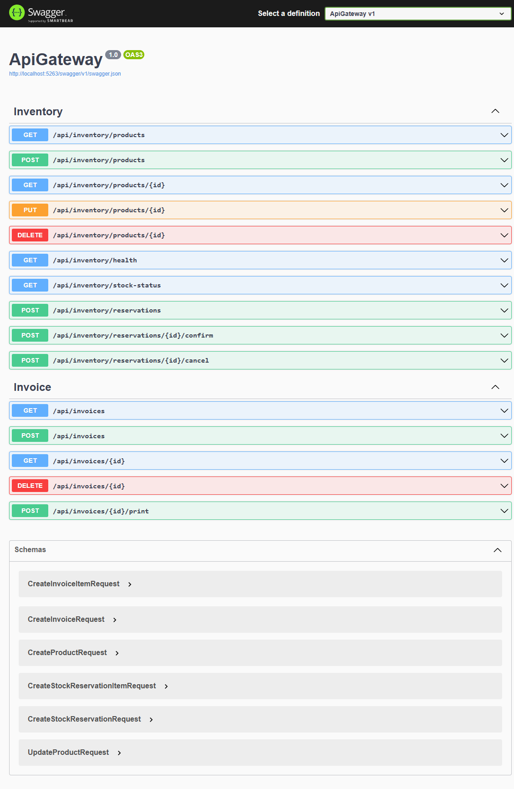
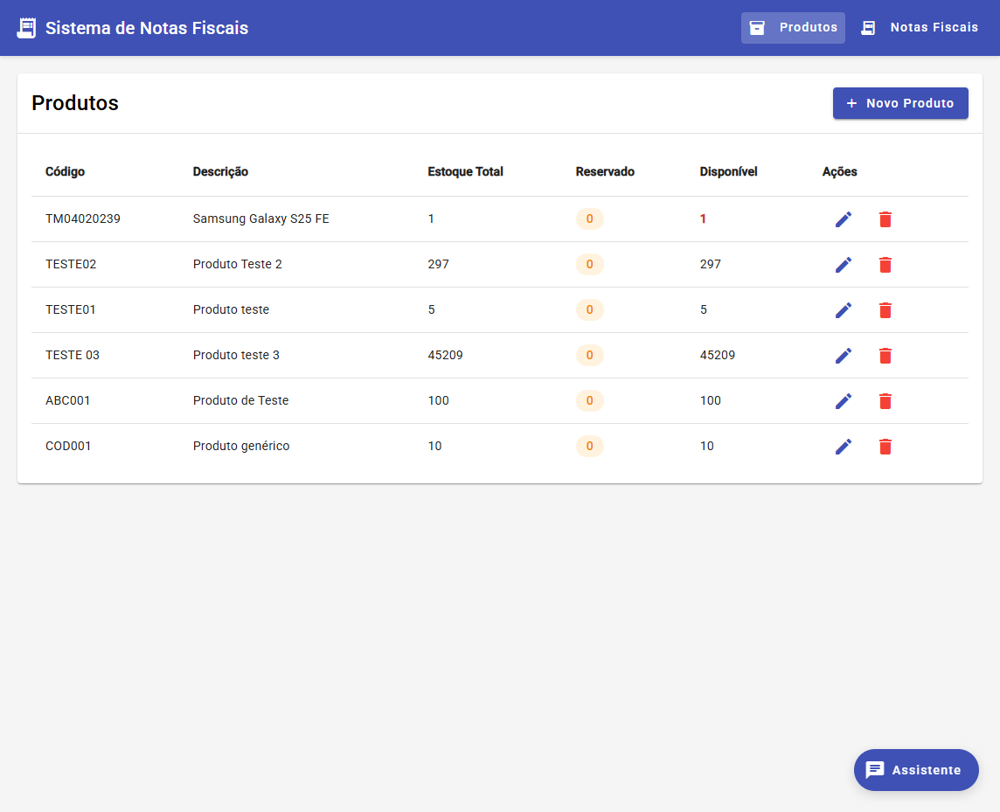
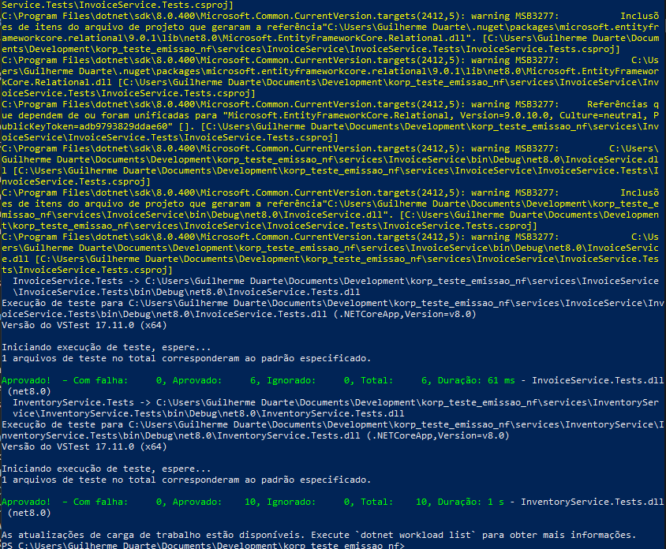
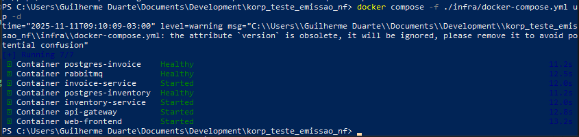
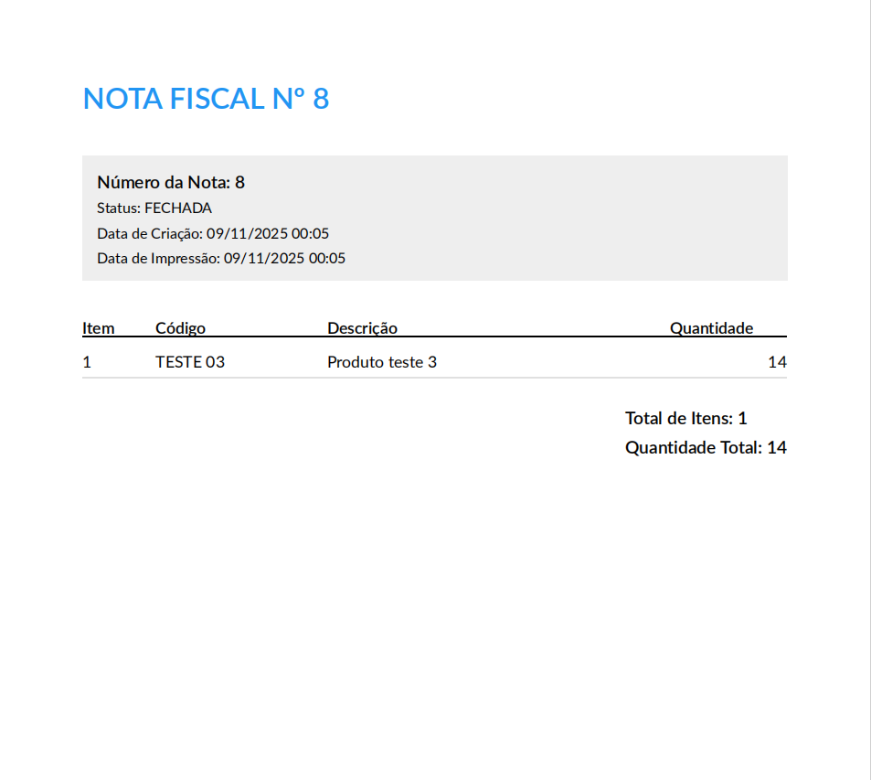
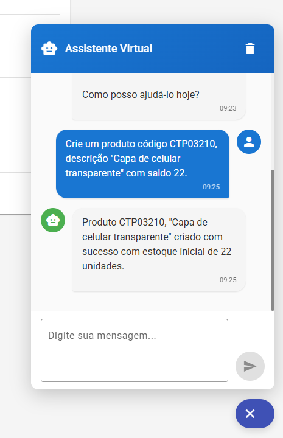

# Korp – Sistema de Emissão de Notas Fiscais


## 1. Objetivo
Implementar um sistema de faturamento (Notas Fiscais) integrado a um serviço de estoque, com arquitetura de microsserviços, garantindo: cadastro de produtos, criação/impressão de notas e atualização consistente de saldo. Inclui tolerância a falhas, idempotência, concorrência e um fluxo Saga para orquestrar reservas de estoque.

## 2. Visão Geral da Arquitetura
Microsserviços:
- InventoryService: estoque, produtos, reservas (lock pessimista, confirmação/cancelamento).
- InvoiceService: criação e estado de notas fiscais, idempotência e geração de PDF.
- ApiGateway: expõe API REST para o front Angular, orquestra Saga e compensa em caso de falha.
- Web (Angular): UI (cadastro, listagem, criação e impressão). 


Infra:
- Mensageria: RabbitMQ via MassTransit (patterns: Request/Response + Publish/Subscribe + Retry).
- Persistência: PostgreSQL (EF Core Migrations + transações + nível de isolamento Serializable onde necessário).
- Health Checks: endpoints `/health` em serviços internos.
- Observabilidade: logging estruturado (ILogger) + Swagger no `ApiGateway`.

### Diagrama Lógico (simplificado)
```
         [Angular]
			 |
             | (HTTP/REST)
			 v 
	    [ApiGateway]
			 |  Saga (criar nota ->  
             |   reservar estoque -> snapshot)
             |  (MassTransit Request/Response)
			 v 
        +----------+
        | RabbitMQ |  (Exchanges/Queues)
        +----------+
             |
       +-------------------------+
       |                         |
       v                         v

 [InvoiceService] <----> [InventoryService]
		|                     |
	Postgres                Postgres
```

### Fluxo Saga de Criação de Nota
```
1. Cliente chama POST /invoices (ApiGateway)
2. ApiGateway -> CreateInvoiceRequest (InvoiceService)
3. InvoiceService cria nota (status Open) + registra idempotency key
4. ApiGateway -> CreateStockReservationRequest (InventoryService)
5. InventoryService valida e cria reserva (lock pessimista FOR UPDATE)
6. ApiGateway publica UpdateInvoiceSnapshotRequest (fire-and-forget)
7. InvoiceService atualiza snapshot dos itens (códigos/descrições)
8. Resposta ao cliente com nota e status
Compensação: se passo 4 falhar, ApiGateway deleta nota (DeleteInvoiceRequest)
```

## 3. Requisitos Atendidos
Obrigatórios:
- Cadastro de Produtos (Create/Update/Delete/List/Get).
- Cadastro de Notas (sequencial, status inicial Aberta, múltiplos itens únicos).
- Impressão: aciona reserva confirmação e fechamento (`PrintInvoiceRequest` fecha e debita estoque).
- Microsserviços separados (Inventory + Invoice + ApiGateway + Angular).
- Tratamento de falhas: compensação Saga, códigos de erro padronizados (`Result<T>` + `ErrorCode`).

Opcionais Implementados:
- Idempotência (InvoiceService: tabela `IdempotencyKeys`, chave usada no CreateInvoiceRequest).
- Concorrência (lock pessimista + isolamento Serializable para geração sequencial de `InvoiceNumber`).
- Chatbot com IA: Implementado uma aba de assistência onde é possível solicitar criação de produtos ou notas fiscais por exemplo.
## 4. Padrões e Decisões Técnicas
- Saga Orquestrada: lógica no `InvoiceService` + orquestração no `ApiGateway` (passos e compensação).
- Idempotência: registro antecipado da chave antes de criar nota; evita duplicação e trata race cond. se houver repetição.
- Lock Pessimista: `SELECT ... FOR UPDATE` em `CreateReservationConsumer` para evitar reserva dupla do mesmo estoque.
- Retry: `cfg.UseMessageRetry(r => r.Immediate(3))` nos três serviços MassTransit.
- Health/Resiliência: health checks de DB e fila; timeouts específicos (`RequestTimeout.After`).
- DTO & Envelope: uso uniforme de `Result<T>` contendo sucesso/erro e metadados.
- Snapshot de itens: após reserva, publica evento para enriquecer nota com códigos/descrições sem bloquear cadeia principal.

## 5. Backend (.NET/C#)
Principais libs/frameworks:
- ASP.NET Core Minimal Hosting
- MassTransit + RabbitMQ
- EF Core + Npgsql
- Microsoft.Extensions.HealthChecks
- Swagger / Swashbuckle
- System.Text.Json + `JsonStringEnumConverter`

LINQ: utilizado em todos os Consumers/Serviços (ex.: agrupamento para detectar produtos duplicados, somatórios de estoque, filtros por status).

Erros/Exceções:
- Try/Catch com log + rollback explícito de transações.
- Mapeamento para `ErrorCode` (e.g. `INSUFFICIENT_STOCK`, `INTERNAL_ERROR`).
- Timeouts tratados com retorno de erro amigável ao usuário.

Transações:
- Inventário: begin transaction + locks; rollback em exceções.
- Invoice: isolamento Serializable para garantir número sequencial e evitar conflitos de idempotência.



## 6. Frontend (Angular)



Arquitetura prevista (resumo):
- Módulos: Produtos, Notas, Shared.
- Ciclos de Vida: `ngOnInit` (carregar dados). Não foi usado: `ngOnDestroy` (limpar subscriptions), `ngAfterViewInit` (gatilhos UI pós-render).
- RxJS: `Observable` para streams de produtos/notas; `Subject` para eventos internos.
- Component Library: Material UI para tabelas, botões e spinners.
- Tratamento de Estado: Serviços Angular com BehaviorSubject para cache local de listas.

## 7. Rotas Principais (ApiGateway)
```
GET    /products
POST   /products
PUT    /products/{id}
DELETE /products/{id}

GET    /invoices?status=Open|Closed
GET    /invoices/{id}
POST   /invoices            (idempotency-key opcional)
POST   /invoices/{id}/print (fecha nota + confirma reserva + debita estoque)
DELETE /invoices/{id}

GET    /inventory/stock-status
```

## 8. Execução e Ambiente
Pré-requisitos: Docker/docker-compose

Imagens usadas: .NET 8 SDK, Node 18+, Angular CLI.

### Subir Stack Completa (PowerShell)
```powershell
# Rodar a aplicação
docker compose -f ./infra/docker-compose.yml up -d 

# Rodar testes (Necessário .NET SDK)
dotnet test
```


#### Screenshot dos testes



#### Screenshot do docker-compose up



### Testes
- Criado uma solution na raiz do projeto para executar todos os testes de cada micro-serviço de uma vez, testes cobrem cenários como criação de produto, reserva, criação de nota fiscal.
- Estratégia futura: testes de contrato (Pact) entre ApiGateway e serviços, testes no front-end.

## 9. Impressão da Nota Fiscal
Fluxo:
1. Usuário abre nota (status Open).
2. Clica em Imprimir → spinner + chamada `PrintInvoiceRequest`.
3. Confirma reserva (se ainda pendente), gera PDF, muda status para Closed.
4. Atualiza saldos no InventoryService.
5. Retorna arquivo (download) + estado atualizado. 



## 10. Idempotência (Detalhe)
Chave enviada → registrada antes da criação. Requisição duplicada retorna mesma nota (replay) sem efeitos colaterais. Trata race conditions com tentativa de salvar chave primeiro e fallback se chave já existir.

## 11. Concorrência
Caso: saldo 1 usado em duas notas simultâneas. Lock pessimista + verificação de reservas pendentes garante consistência (uma falha com `INSUFFICIENT_STOCK`). 

## 12. Tratamento de Falhas
- Falha em reserva: compensação deletando nota.
- Timeout em serviço: retorna mensagem amigável + status HTTP adequado (4xx/5xx via filter de validação).
- Retentativas automáticas em Mensageria (3 imediatas).

## 13. Uso de IA 
Usando uma interface de abstração de um service de IA no Angular, implementei duas classes, usando o ChatGPT o Gemini como modelos de IA, e fazendo uso do conceito de tools que essas IA's possuem, consegui implementar um mêcanismo onde o próprio chatbot consegue chamar as requisições back-end com os parâmetros necessários.



## 14. Próximos Passos
- Implementar testes de integração.
- Adicionar tracing distribuído (OpenTelemetry).
- Cache de produtos (Redis) para reduzir latência.
- Segurança: criação de usuários, autentificação, bearer token com JWT
- Separação do sistema por empresa/grupo, cada usuário vinculado a uma organização

## 15. Estrutura de Pastas (Resumo)
```
services/
	ApiGateway/       -> Orquestração, REST, Swagger
	InventoryService/ -> Produtos, Reservas, Locks
	InvoiceService/   -> Notas, Idempotência, PDF
	web/              -> Angular SPA (UI)
shared/             -> Contratos e Result<T>
infra/              -> docker-compose (RabbitMQ, PostgreSQL)
```

### Configuração de ambiente do Angular

Por segurança, os arquivos `environment.ts` e `environment.prod.ts` **não são versionados**. Para rodar o front-end, copie o arquivo de exemplo e preencha localmente:

```powershell
cp services/web/src/environments/environment.example.ts services/web/src/environments/environment.ts
cp services/web/src/environments/environment.example.ts services/web/src/environments/environment.prod.ts
```

Preencha as chaves de API (`openAiApiKey`, `geminiApiKey`) manualmente, conforme necessário.

Exemplo:
```typescript
export const environment = {
	production: false,
	apiUrl: 'http://localhost:5263/api',
	aiProvider: 'gemini',
	openAiApiKey: '', // sua chave local
	openAiModel: 'gpt-3.5-turbo',
	geminiApiKey: '', // sua chave local
	geminiModel: 'gemini-2.0-flash',
};
```


## 18. Licença
Projeto de avaliação técnica – processo seletivo Korp.

### Vídeo de Demonstração

Assista ao vídeo mostrando todos os fluxos, códigos de erro e pontos de resiliência implementados: 

[https://www.youtube.com/watch?v=ZmB-gSbHpxQ](https://www.youtube.com/watch?v=ZmB-gSbHpxQ)

